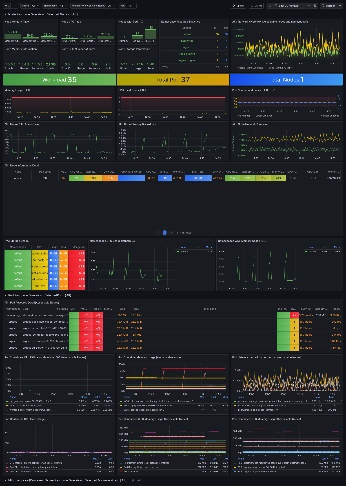

# Homelab e Kubernetes 

Este repositório documenta a Infraestrutura como Código (IaC) e os manifestos Kubernetes utilizados no meu Homelab pessoal. O projeto roda em um notebook reaproveitado como servidor.

## Arquitetura

O cluster é um **Single Node** rodando K3s em bare-metal (Ubuntu Server). O acesso externo é gerenciado via Cloudflare Tunnel, eliminando a necessidade de abrir portas no roteador (CGNAT friendly).

## Stack Tecnológica

#### • Hardware: Notebook Pessoal
#### • Cluster K8s: [K3s](https://k3s.io/)
#### • Networking: Cloudflare Tunnel (cloudflared)
#### • Observabilidade: Prometheus & Grafana (via Helm)
#### • Gerenciamento de Pacotes: Helm
#### • Aplicações:
####    •   Frontend: React + Vite
####    •   Backend: Java Spring Boot (Microservices)
####    •   Banco: PostgreSQL

## Deploy das Aplicações (Helm Charts)

Todo o gerenciamento das aplicações é feito via Helm. Criei um chart com front web e backend que sobe toda a stack.
Estrutura do Chart

#### •  frontend/: React SPA
#### • backend/: API Gateway + Auth Service (Spring Boot)
#### • database/: PostgreSQL com persistência (PVC)

## Observabilidade (Prometheus & Grafana)

Monitoramento de métricas de infraestrutura e aplicação (JVM).

#### • Métricas: [Kube Prometheus Stack](https://github.com/prometheus-community/helm-charts/tree/main/charts/kube-prometheus-stack)

