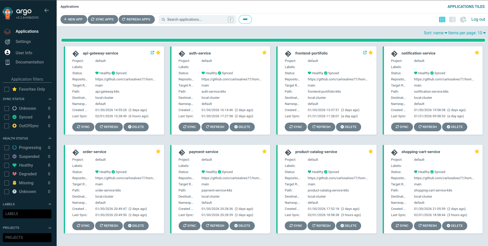
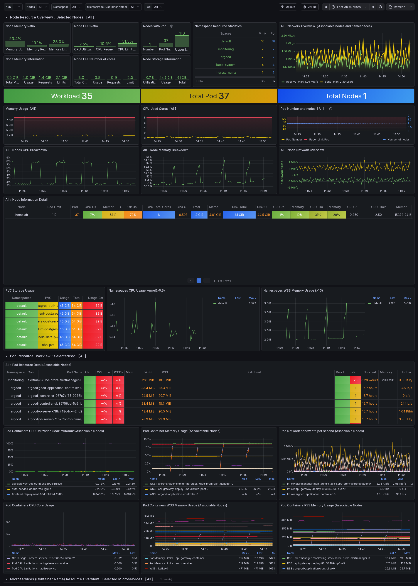

# Homelab e Kubernetes 

Este repositório documenta a Infraestrutura como Código (IaC) e os manifestos Kubernetes utilizados no meu Homelab pessoal. O projeto roda em um notebook reaproveitado como servidor.


  


## ⚙️ Hardware & Restrições
O cluster roda em um hardware limitado, exigindo otimização de recursos (CPU/RAM).

| Componente | Especificação |
| :--- | :--- |
| **Dispositivo** | Notebook Dell 3420 |
| **CPU** | Intel Core i5 (4 Cores) |
| **RAM** | 8 GB DDR4 |
| **Armazenamento** | SSD 256GB |
| **OS Host** | Ubuntu Server 22.04 LTS |


## Arquitetura

O cluster é um **Single Node** rodando K3s em bare-metal (Ubuntu Server). O acesso externo é gerenciado via Cloudflare Tunnel, eliminando a necessidade de abrir portas no roteador.


## Stack Tecnológica

#### • Hardware: Notebook Pessoal
#### • Cluster K8s: [K3s](https://k3s.io/)
#### • Networking: Cloudflare Tunnel (cloudflared)
#### • Observabilidade: Prometheus & Grafana (via Helm)
#### • Aplicações:
####    •   Frontend: React + Vite
####    •   Backend: Java Spring Boot (Microservices)
####    •   Banco: PostgreSQL
####    •   GitOps: ArgoCD

--- 

## Deploy e GitOps

O deploy das aplicações segue a metodologia **GitOps**. O Argo CD monitora este repositório e sincroniza automaticamente qualquer alteração feita nos manifestos YAML com o estado do cluster.

###  Estrutura dos Manifestos

A organização dos recursos Kubernetes está dividida por responsabilidade, contendo todos os microsserviços do ecossistema:

```plaintext
├── apps/
│   ├── api-gateway/           # Spring Cloud Gateway (Entrada)
│   ├── auth-service/          # Autenticação & Segurança
│   ├── cart-service/          # Gerenciamento de Carrinho
│   ├── notification-service/  # Disparo de Notificações
│   ├── order-service/         # Processamento de Pedidos
│   ├── payment-service/       # Integração de Pagamentos
│   ├── product-service/       # Catálogo de Produtos
│   └── frontend/              # Front-end React (Nginx)
├── infra/
│   ├── database/              # PostgreSQL (StatefulSet + PVC + Secrets)
│   ├── monitoring/            # Kube-Prometheus-Stack (Helm Values)
│   └── argocd/                # Definições das "Applications" do Argo
└── cloudflare/                # Configuração do Tunnel (Cloudflared)

``` 


#### •  Frontend/: React SPA
#### • Backend/: API Gateway, Auth Service, Product Service, Order Service, Payment Service, Cart Service, Notification Service.
#### • Database/: PostgreSQL com persistência (PVC)


Pipeline de CI/CD 

A automação é garantida via GitHub Actions e Argo CD. Nenhum deploy manual é necessário para as aplicações.

1. CI (Integração): Ao commitar no repositório da aplicação (código Java/React), o GitHub Actions executa os testes, builda a imagem Docker e publica no Docker Hub com uma tag única (ex: v0.0.5-a1b2c).

2. CD (Entrega): O pipeline atualiza automaticamente a tag da imagem no arquivo deployment.yaml deste repositório.

3. Sync: O Argo CD detecta a mudança no Git e atualiza os Pods no cluster K3s em tempo real.

```

    Dev[Dev Push] -->|Gatilho| CI[GitHub Actions]
    CI -->|Build & Push| Registry[Docker Hub]
    CD -->|Update Tag| Git[Infra Repo (YAML)]
    Git -->|Sync| Argo[Argo CD]
    Argo -->|Deploy| K8s[Cluster K3s]


```

### Dashboard ArgoCD



--- 

## Observabilidade (Prometheus & Grafana)

Monitoramento de métricas de infraestrutura e aplicação (JVM).

#### • Métricas: [Kube Prometheus Stack](https://github.com/prometheus-community/helm-charts/tree/main/charts/kube-prometheus-stack)




